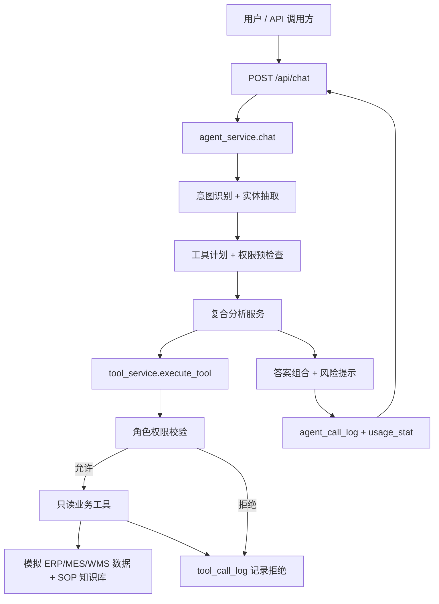

# 制造业企业内部 AI Agent 后端 MVP

本项目是面向制造业企业内部业务查询的 AI Agent 后端 MVP。当前重点是演示自然语言业务查询、只读工具调用、SOP 检索、角色权限、审计日志、用量统计、mock LLM Gateway、RAG eval 和 Docker/Nginx 启动能力。

本项目为 MVP 原型，使用模拟 ERP/MES/WMS 数据，不接入真实企业生产系统。
Agent 工具全部为只读查询或分析工具，不执行出库、调账、审批、下单等业务写操作。
后续接入真实企业系统时，可将模拟接口替换为真实 API、数据库视图或中间表。

## 项目定位

目前项目是 MVP。后端用 FastAPI。数据是模拟 ERP/MES/WMS 表。Agent 只做只读查询、复合分析和 SOP 检索。权限和调用日志已放在主流程里。真实接入时可以替换接口层。

不包含多租户、Kubernetes、复杂 CI/CD 平台、真实 ERP/MES/WMS 写入、订单审批、采购审批、自动出库或自动调账。

## 架构图



## JD 对齐能力说明

- 企业级 Agent / 工具调用：`/api/chat` 生成工具计划、权限预检查、只读工具调用和 `decision_record`。
- Agent 治理：响应和审计日志包含 `risk_factors`、`requires_human_review`、`manual_review_reason`、execution trace。
- 大模型网关 / 路由：mock LLM Gateway 记录 provider、model、fallback、token 估算和 latency，不依赖外部 API。
- RAG / 知识库：SOP 检索返回 `source_path`、`score`、`matched_terms`，并提供 RAG eval report。
- 权限与安全：角色权限在每次工具调用前校验，拒绝路径写入 `tool_call_log`。
- 用量管理：admin usage stats 支持日期过滤、成功率、拒绝率、平均延迟、top tools、top intents。
- Docker / Nginx / 私有化部署：提供 Compose、Nginx、`.env.production.example` 和私有化部署说明。

## P0-P7 能力清单

- FastAPI 基础应用与 `GET /health`。
- SQLAlchemy 模型，Docker 演示环境使用 PostgreSQL，本地开发和测试可使用 SQLite fallback。
- 模拟销售订单、库存、工单、采购、SOP 知识、审计和用量数据。
- 只读工具：订单、库存、工单、采购到货、异常 SOP。
- `/api/chat` 规则路由、实体抽取、工具计划和复合分析。
- 角色权限检查，权限拒绝写入 `tool_call_log`。
- `agent_call_log`、`tool_call_log`、`usage_stat`。
- SOP 检索与知识库重建接口。
- Docker Compose 启动文件。
- P5-P7 增强字段：`decision_record`、`risk_factors`、`requires_human_review`、`manual_review_reason`、`evidence`、`recommendations`。
- 轻量本地 RAG 评分和 `scripts/run_rag_eval.py`。
- mock LLM Gateway / model routing。
- 私有化部署证据链和诺必达 JD 面试材料。

## 技术栈

- Python
- FastAPI
- SQLAlchemy
- Pydantic Settings
- PostgreSQL Docker 演示环境
- SQLite 本地开发默认回退
- Docker Compose
- Nginx 反向代理演示入口

## 快速启动

本地启动：

```bash
python -m venv .venv
pip install -r requirements.txt
python -m app.db.init_db
python scripts/seed_demo_data.py
uvicorn app.main:app --host 0.0.0.0 --port 8000 --reload
```

验证健康检查：

```bash
curl http://localhost:8000/health
```

Docker 启动：

```bash
cp .env.example .env
docker compose config
docker compose up --build
```

Docker 默认使用 PostgreSQL。首次启动后可在 backend 容器内执行：

```bash
docker compose exec backend python -m app.db.init_db
docker compose exec backend python scripts/seed_demo_data.py
```

也可以通过 Nginx 入口访问：

```bash
curl http://localhost:8080/health
```

若本地只想快速开发，可以继续使用 `.env.example` 中的 `DATABASE_URL=sqlite:///./local_dev.db`。

## Demo Report

生成面试演示报告：

```bash
python scripts/run_demo_report.py
```

脚本会重置并 seed demo 数据，用 TestClient 跑 5 个必答问题，并覆盖 `admin`、`sales`、`warehouse`、`purchase`、`production_manager`、`normal_user` 的代表场景。输出文件：

```text
docs/demo-report.md
```

## RAG Eval Report

生成 SOP 检索评估报告：

```bash
python scripts/run_rag_eval.py
```

输出文件：

```text
docs/rag-eval-report.md
```

面试讲解稿见：

```text
docs/interview-walkthrough.md
docs/interview-answer-nuobida.md
docs/resume-project-bullets-nuobida.md
```

## Docker / 私有化部署入口

私有化部署说明见：

```text
docs/deployment-private-cloud.md
docs/deployment-check-report.md
.env.production.example
```

## 测试

```bash
python -m compileall app
pytest
docker compose config
```

## API

- `GET /health`
- `POST /api/chat`
- `POST /api/tools/query-order-status`
- `POST /api/tools/query-inventory-by-sku`
- `POST /api/tools/query-work-order`
- `POST /api/tools/query-purchase-arrival`
- `POST /api/tools/query-exception-sop`
- `POST /api/tools/analyze-order-delivery-risk`
- `POST /api/tools/analyze-work-order-readiness`
- `POST /api/tools/analyze-purchase-delay-impact`
- `POST /api/knowledge/rebuild`
- `GET /api/knowledge/search`
- `GET /api/admin/agent-call-logs`
- `GET /api/admin/agent-call-logs/{call_id}`
- `GET /api/admin/tool-call-logs`
- `GET /api/admin/tool-call-logs/{log_id}`
- `GET /api/admin/usage-stats`

Admin 日志接口需要 `role=admin`。工具调试 API 也会先做权限校验，越权调用会写入 `tool_call_log`。

`GET /api/admin/usage-stats?role=admin` 支持 `date_from=YYYY-MM-DD` 和 `date_to=YYYY-MM-DD`，并返回成功率、拒绝率、平均延迟、top tools、top intents。

## 演示问题

通过 `/api/chat` 可以测试：

```text
订单 O1001 现在能不能发货？
工单 WO1001 今天能不能开工，缺哪些物料？
采购单 PO1001 延期会影响哪些客户订单？
SKU-KB-001 当前可用库存是多少？有哪些批次？
注塑件外观不良应该怎么处理？
```

请求示例：

```bash
curl -X POST http://localhost:8000/api/chat \
  -H "Content-Type: application/json" \
  -d "{\"username\":\"demo_admin\",\"role\":\"admin\",\"question\":\"订单 O1001 现在能不能发货？\"}"
```

每个回答会说明检查的数据、调用工具、权限结果、业务结论、建议下一步，以及高风险业务动作需要人工确认。

## 角色

- `admin`
- `production_manager`
- `sales`
- `warehouse`
- `purchase`
- `normal_user`

`normal_user` 只能查询公开 SOP 或通用知识内容，不能查询订单、库存、工单或采购数据。

## 只读工具

- `query_order_status`
- `query_inventory_by_sku`
- `query_work_order`
- `query_purchase_arrival`
- `query_exception_sop`
- `analyze_order_delivery_risk`
- `analyze_work_order_readiness`
- `analyze_purchase_delay_impact`

这些工具只查询模拟数据或 SOP 文档。审计日志由 service 层统一记录，工具函数内不写业务数据。

## 当前边界

本项目为 MVP 原型，使用模拟 ERP/MES/WMS 数据，不接入真实企业生产系统。
Agent 工具全部为只读查询或分析工具，不执行出库、调账、审批、下单等业务写操作。
后续接入真实企业系统时，可将模拟接口替换为真实 API、数据库视图或中间表。

当前 `/api/chat` 仍以规则路由为主，SOP 检索使用关键词匹配，数据全部来自模拟表和本地 SOP 文档；不会连接真实 ERP/MES/WMS，也不会执行写侧业务动作。

## P8 React 前端控制台

已新增 `frontend/`，使用 React + TypeScript + Vite 实现企业后台控制台。前端通过 `/api/auth/login` 获取 JWT，并优先使用 `Authorization: Bearer <token>` 调用后端 API；旧 `username` / `role` 参数保留用于兼容既有测试和演示命令。

前端页面包括：

- 登录页。
- Chat 工作台：展示 answer、called tools、permission results、risk factors、manual review reason、decision record。
- Admin Dashboard：读取 usage stats、success rate、denied rate、avg latency、top tools、top intents。
- Audit Logs：读取 agent call logs、tool call logs，并展示 call detail。
- Knowledge Search：展示 doc title、source path、score、matched terms。
- Permission Center：展示当前 demo 权限、提交平台权限申请、查看申请历史。
- Admin Approval Center：读取 pending permission requests，并支持 approve / reject。
- Deployment Status：调用 `/health`，并展示 demo report / RAG eval report 位置。

前端本地启动：

```bash
cd frontend
npm install
npm run dev
```

前端验证：

```bash
cd frontend
npm run test:smoke
npm run build
```

P8 smoke test 覆盖：

- `normal_user` 看不到 admin 菜单。
- `admin` 能访问 dashboard、audit logs、approval center 和 deployment status 菜单。
- Chat 工作台会展示 answer、called tools、permission results、risk factors、manual review reason 和 decision record。
- Admin Dashboard 会读取 `/api/admin/usage-stats` 与 `/api/admin/metrics`。
- Audit Logs 会读取 agent/tool log 列表，并通过 `/api/admin/agent-call-logs/{id}` 拉取 call detail。
- Knowledge Search 会展示 SOP doc title、source path、score 和 matched terms。
- Deployment Status 会调用 `/health` 并展示 demo report / RAG eval report 位置。
- `normal_user` 可在 Permission Center 提交平台权限申请。
- `admin` 可在 Admin Approval Center 审批 pending permission requests。
- 当服务端 RBAC 菜单不包含 `chat` 时，前端不会回退展示 Chat 页面。
- 已登录请求返回 401 时会回到登录页，并提示 token 已过期或未登录。
- 页面 API 返回 403 时会展示明确的无权限提示。
- 未知路由在登录前也会展示 404 页面。

## P9 JWT / RBAC 权限系统

P8/P9/P10 补充：React 控制台登录后会使用 bearer token 调用 `/api/menus` 与 `/api/auth/permissions`，导航菜单和 Permission Center 的权限列表以服务端 RBAC 返回结果为准；前端静态角色表仅作为兜底，不作为真实授权依据。当前 smoke test 覆盖 normal_user 隐藏 admin 菜单、admin 展示后台菜单、Chat 工作台治理字段展示、Admin Dashboard 指标加载和 403 权限提示、Audit Logs 列表和 agent call detail、Knowledge Search SOP 结果展示、Deployment Status `/health` 检查、Permission Center 展示服务端权限集合、平台权限申请提交、admin pending request 审批、无 `chat` 菜单时不错误回退到 Chat 页面、token 过期后回到登录页，以及未知路由 404 页面。

P9 补充：`POST /api/knowledge/rebuild` 作为平台管理接口，除 `admin` 角色外还要求 `api:knowledge-rebuild` API 权限；这只重建本地模拟 SOP 知识块，不接入真实 ERP/MES/WMS，也不执行写侧业务动作。

已新增轻量 JWT 登录与服务端 RBAC：

- `POST /api/auth/login`：demo 用户登录，默认密码为 `demo123456`。
- `GET /api/auth/me`：返回 token 身份和权限。
- `GET /api/auth/permissions`：返回当前用户权限集合。
- `GET /api/menus`：按 RBAC 返回可见菜单。

新增 RBAC 表：

- `auth_user`
- `auth_role`
- `auth_permission`
- `auth_role_permission`
- `auth_user_role`
- `auth_user_permission_grant`
- `auth_menu_permission`
- `auth_api_permission`
- `auth_document_permission`

兼容策略：

- 旧接口继续支持 demo `role` 参数，保证既有测试和演示命令可用。
- 新前端优先使用 `Authorization: Bearer <token>`。
- token 和 `role` 参数同时存在时，以 token 身份为准。
- admin API 已接入 API 级权限校验；知识检索已接入 `document:sop-public` 文档级权限。

P9 验证：

```bash
python -m compileall app
pytest tests/test_p9_auth_rbac.py -q
pytest -q
cd frontend
npm run test:smoke
npm run build
```

## P10 权限申请与管理员审批

P10 补充：权限审批管理接口不仅要求 `admin` 角色，还要求 `api:admin-permission-requests` API 权限；测试已覆盖 admin 缺少该 API 权限时列表和审批动作均返回 403，并写入 denied `tool_call_log` 审计记录。

已新增平台权限申请与 admin 审批流。该流程只写平台管理数据，不是 ERP/MES/WMS 业务审批；不会审批订单、采购、出库、调账、工单开工等业务动作。

新增 API：

- `POST /api/permissions/requests`
- `GET /api/permissions/requests/my`
- `GET /api/admin/permission-requests`
- `POST /api/admin/permission-requests/{request_id}/approve`
- `POST /api/admin/permission-requests/{request_id}/reject`

行为：

- 普通用户可申请平台权限，例如 `menu:admin-dashboard`。
- admin 审批通过后，系统写入 `auth_user_permission_grant`，`GET /api/menus` 会返回新授权菜单。
- admin 拒绝后，不会授予权限。
- 申请和审批都会写入 `tool_call_log`，工具名分别为 `platform_permission_request` 与 `platform_permission_approval`，用于平台审计。

P10 验证：

```bash
pytest tests/test_p10_permission_requests.py -q
pytest -q
cd frontend
npm run test:smoke
npm run build
```

## P11 本地前后端 Docker/Nginx 一体化

已新增 Nginx 前端静态托管：

- `docker/nginx.Dockerfile`：把本地构建好的 `frontend/dist` 拷入 Nginx 镜像并托管。
- `docker/nginx.conf`：`/` 返回 React SPA，`/api/`、`/health`、`/docs`、`/openapi.json` 反代到 FastAPI。
- `docker-compose.yml`：`nginx` 服务改为本地构建，并继续包含 `backend`、`postgres`、`redis`。

文档：

- `docs/frontend-deployment.md`
- `docs/local-fullstack-deployment-check-report.md`

P11 验证：

```bash
cd frontend
npm run build
cd ..
docker compose config
```

完整本地运行：

```bash
docker compose up -d --build
docker compose exec backend python -m app.db.init_db
docker compose exec backend python scripts/seed_demo_data.py
curl http://localhost:8080/health
```

## P12 云服务器部署准备

已新增云服务器部署准备文档，但当前不宣称已经真实云部署：

- `docs/cloud-server-buying-guide.md`
- `docs/cloud-deployment-runbook.md`
- `docs/cloud-deployment-check-report.md`

推荐先完成 P11 本地 Docker/Nginx 一体化，再购买服务器。云服务器建议 2 核 4G、Ubuntu 22.04 LTS 或 24.04 LTS、40GB SSD 起。真实执行后，应把 `docker compose config`、`docker compose ps`、`curl http://<server-ip>/health` 等输出写入 cloud deployment check report。

云服务器 HTTP 验证脚本：

```bash
python scripts/verify_cloud_deployment.py --base-url http://<server-ip>
```

该脚本会检查 Nginx 是否能返回 React SPA 根页面、`/health` 是否正常、管理员登录是否可用、携带 Bearer token 调用 `/api/chat` 是否成功，以及 admin usage stats / metrics 只读接口是否可访问。

真实云服务器验证通过后，可自动写入云部署检查报告：

```bash
python scripts/verify_cloud_deployment.py --base-url http://<server-ip> --environment cloud --write-report docs/cloud-deployment-check-report.md
```

云部署前先检查 `.env.production` 是否仍使用默认 demo 密钥：

```bash
python scripts/check_production_env.py --env-file .env.production
```

本地可先用当前 Docker/Nginx 环境彩排：

```bash
python scripts/verify_cloud_deployment.py --base-url http://localhost:8080 --environment local
```

`localhost`、`127.0.0.1`、`::1` 只能作为本地彩排证据；脚本会拒绝把这些 loopback 地址标记为 `--environment cloud`。

可选云服务器上传包：
```bash
cd frontend
npm install
npm run build
cd ..
python scripts/package_cloud_deployment.py --output dist-cloud/manufacturing-ai-agent-cloud.zip
python scripts/verify_cloud_package.py --package dist-cloud/manufacturing-ai-agent-cloud.zip
python scripts/verify_cloud_report.py --report docs/cloud-deployment-check-report.md
```

该 zip 用于不方便直接 Git clone 的服务器上传场景。打包脚本会同时生成 `.zip.sha256` 和 `.zip.manifest.json`，本地可先用 `scripts/verify_cloud_package.py` 校验 manifest、SHA-256 和排除规则；上传服务器后可再执行 `sha256sum -c manufacturing-ai-agent-cloud.zip.sha256` 校验包完整性。包内保留运行源码、Docker/Nginx 文件和 `frontend/dist`，并排除本地 `.env`、本地 SQLite 数据库、缓存目录和 `frontend/node_modules`。
`scripts/verify_cloud_report.py` 用于检查云部署报告是否仍保留边界说明、是否误把本地彩排写成云证据、是否出现禁止的生产落地表述。

### DeepSeek API 配置

DeepSeek API Key 只配置在服务器端 `.env.production`，不要放到 React 前端、仓库、文档或聊天记录里。若 Key 曾经粘贴到聊天窗口，请在 DeepSeek 控制台作废旧 Key，并生成新 Key 后只在服务器终端输入。

服务器部署目录中修改：

```env
LLM_GATEWAY_MODE=deepseek
LLM_PROVIDER=deepseek
LLM_MODEL=deepseek-chat
LLM_FALLBACK_MODEL=mock-safe-fallback
DEEPSEEK_API_KEY=<只在服务器输入的新 Key>
DEEPSEEK_BASE_URL=https://api.deepseek.com
DEEPSEEK_TIMEOUT_SECONDS=20
```

重启云端服务：

```bash
sudo docker compose -f docker-compose.yml -f docker-compose.cloud.yml --env-file .env.production up -d --build
```

DeepSeek 当前用于 LLM Gateway 的路由与 token 用量记录；业务回答仍受后端只读工具、RBAC 权限校验和审计日志约束。

## P13 CI / 观测性

## P15 产品化补强清单

权限直改审计、审批来源区分、草稿保护、页面自然刷新、部署日志可视化、聊天历史和常见问题入口等产品化事项见 `docs/p15-product-hardening-backlog.md`。

已新增：

- request id middleware，响应头返回 `x-request-id`。
- `agent_call_log.request_id` 与 `tool_call_log.request_id`。
- `GET /api/admin/metrics`。
- React Admin Dashboard 同时展示 `/api/admin/usage-stats` 与 `/api/admin/metrics`。
- `scripts/run_ci_checks.py`。
- `.github/workflows/ci.yml`。
- `docs/ci-cd-check-report.md`。

P13 targeted 验证：

```bash
pytest tests/test_p13_observability.py -q
```

本地 CI 聚合命令：

```bash
python scripts/run_ci_checks.py
```

## P15 Current Increment

- Added `permission_change_log` for platform RBAC change traceability.
- Approval approve/reject now requires `approval_comment` and records `source=request_approval`.
- Admin direct role permission save requires `remark`, records `source=admin_direct_change`, and logs denied attempts.
- Added `GET /api/admin/permission-change-logs`, `GET /api/admin/role-permissions/{role_code}`, and `POST /api/admin/role-permissions/{role_code}`.
- These APIs manage platform access permissions only; Agent tools remain read-only and do not perform ERP/MES/WMS business writes.
- Added read-only deployment center APIs: `GET /api/admin/deployment/status` and `GET /api/admin/deployment/logs/{service}` for backend/nginx/postgres/redis status and recent logs.
- Added audit filters for `agent-call-logs`, `tool-call-logs`, and `permission-change-logs`, plus React audit-screen filter controls.
- Audit tool rows show Chinese business labels while detail JSON keeps the internal tool names for traceability.
